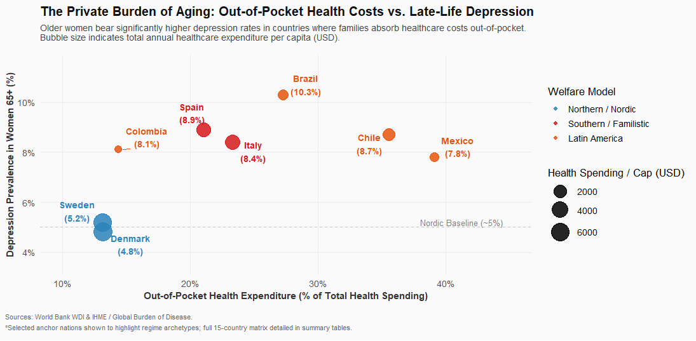

# The Private Burden of Aging: Welfare Regimes, Healthcare Costs, and Late-Life Depression

A study exploring the connection between welfare models, out-of-pocket health costs, and late-life mental health across Northern Europe, Southern Europe, and Latin America.

---

### The Finding in One Chart



### Key Takeaways

* **Baseline Parity:** Adult female depression rates (ages 15+) are remarkably consistent across all three regions (~5.4% to 6.0%).
* **The Late-Life Split (65+):** * In the **Nordic cohort** (Sweden, Denmark), late-life female depression falls to **5.0%** (a protective effect).
  * In **Southern Europe** (Spain, Italy) and **Latin America** (Brazil, Chile, Mexico, Colombia), it surges to **8.6% – 10.3%**.
* **A Gendered "Aging Penalty":** This late-life increase is concentrated in women (+2.8% to +3.2% jump). Older men across all regions maintain flat or declining depression rates.
* **The Economic Link:** The surge tracks healthcare financing: where families pay 25%–40%+ of health expenses out-of-pocket, late-life psychological distress rises sharply.

---

### Data Sources & Packages

* **Eurostat (`eurostat`):** European Health Interview Survey (`hlth_ehis_mh1e`), household composition (`ilc_lvph01`).
* **World Bank (`WDI`):** Out-of-pocket health expenditure (`SH.XPD.OOPC.CH.ZS`), per-capita spending (`SH.XPD.CHEX.PC.CD`).
* **IHME / Global Burden of Disease:** Regional depression benchmarks.
* **Stack:** R (`tidyverse`, `ggplot2`, `ggrepel`, `WDI`, `eurostat`).

### Replication

```r
# Install packages
install.packages(c("tidyverse", "eurostat", "WDI", "ggrepel", "countrycode"))

# Run pipeline
source("wdi_gender_age.R")
